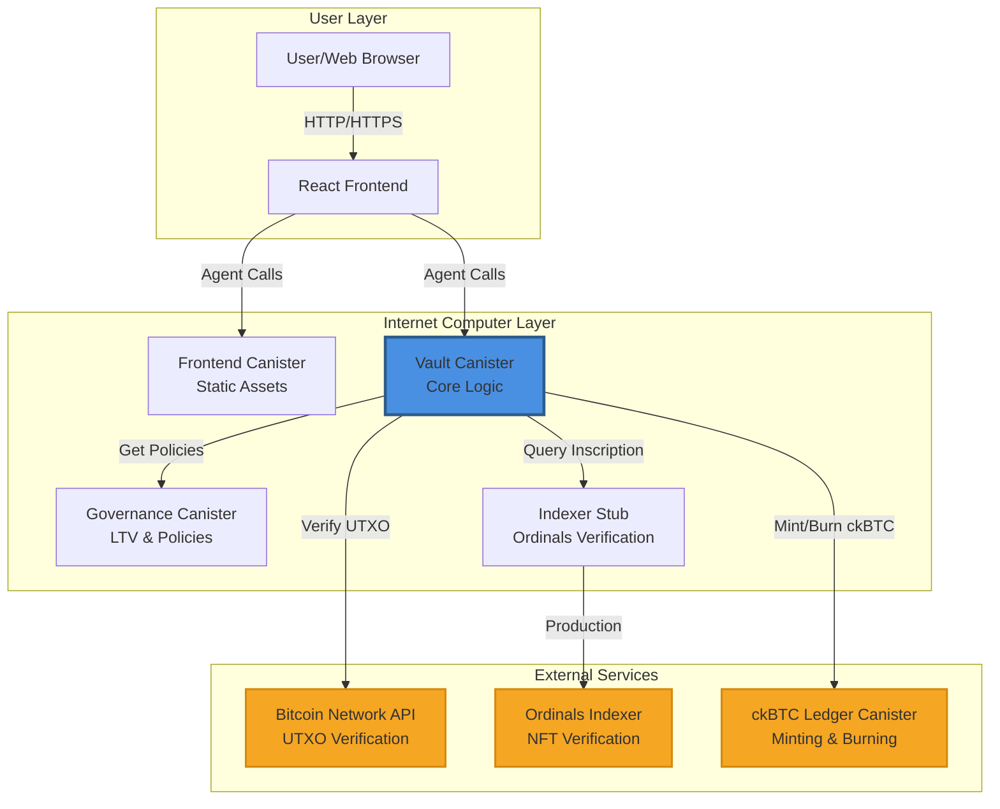
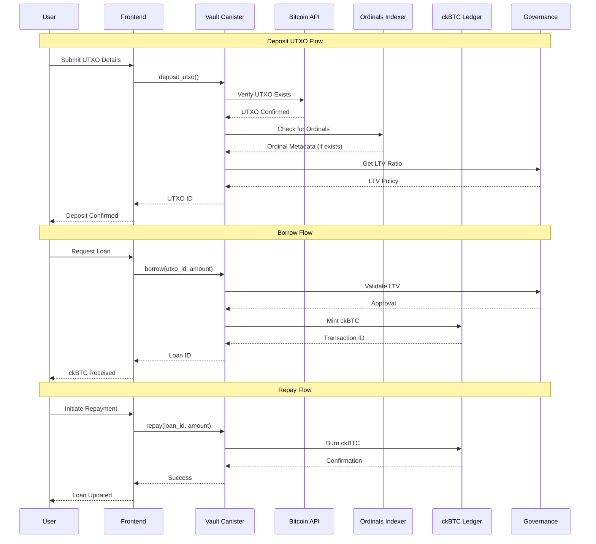
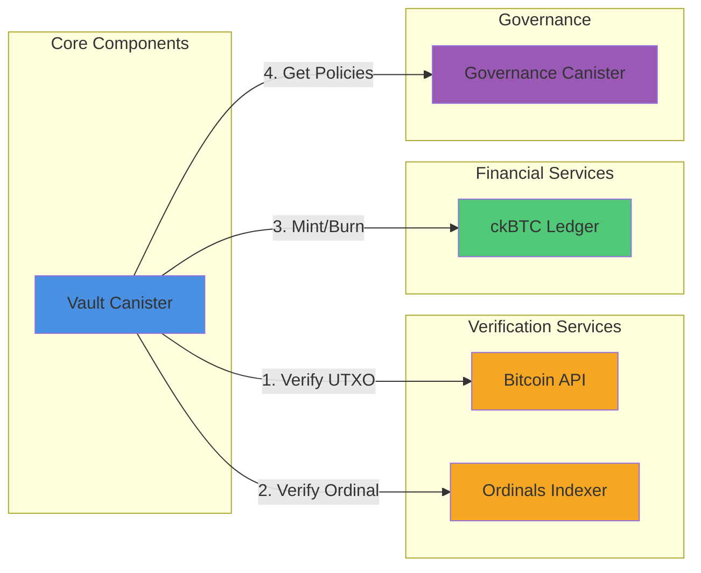
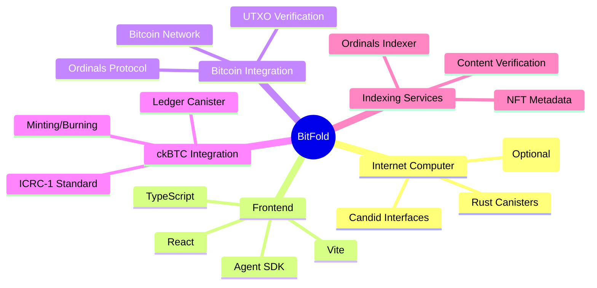

# BitFold Integration Flowchart

This document provides a visual representation of how BitFold integrates with external systems and components.

## System Integration Architecture

## Data Flow Integration

## Component Communication

## Technology Stack Integration

