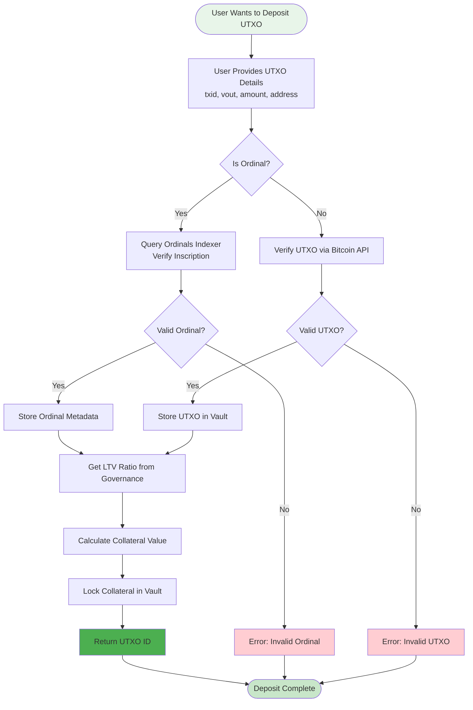
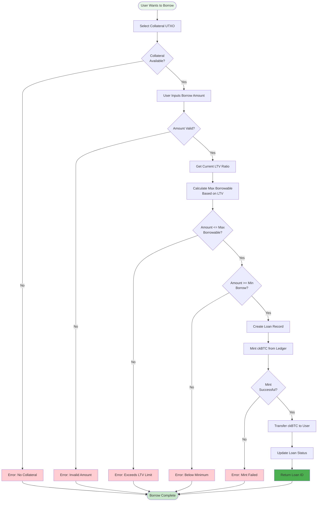
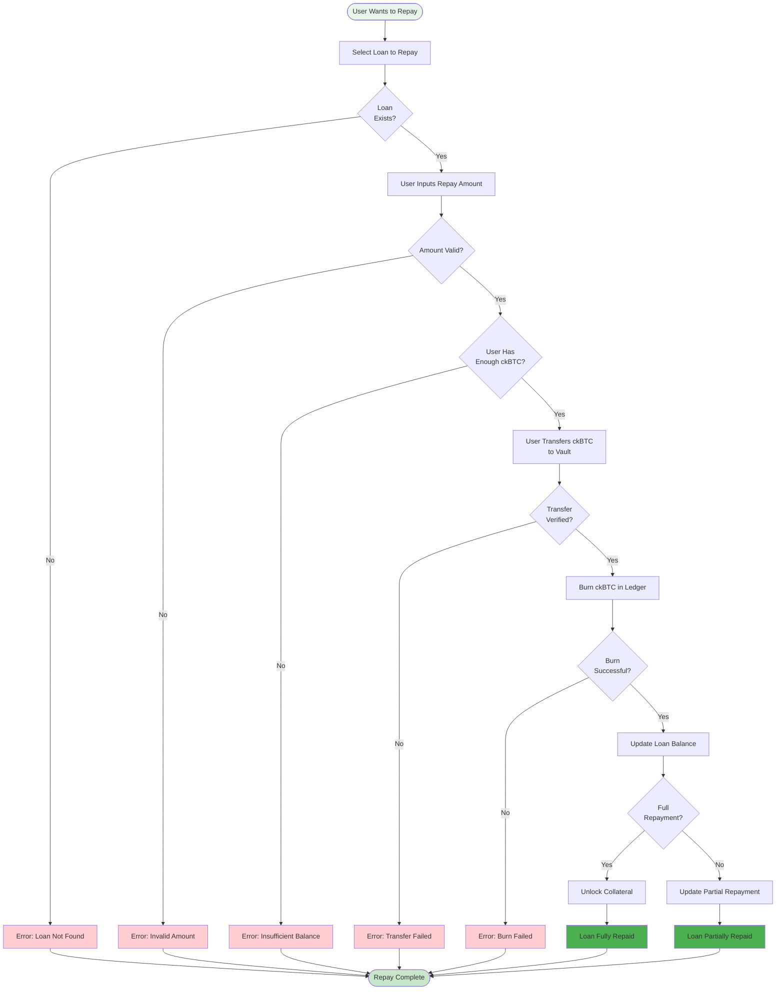
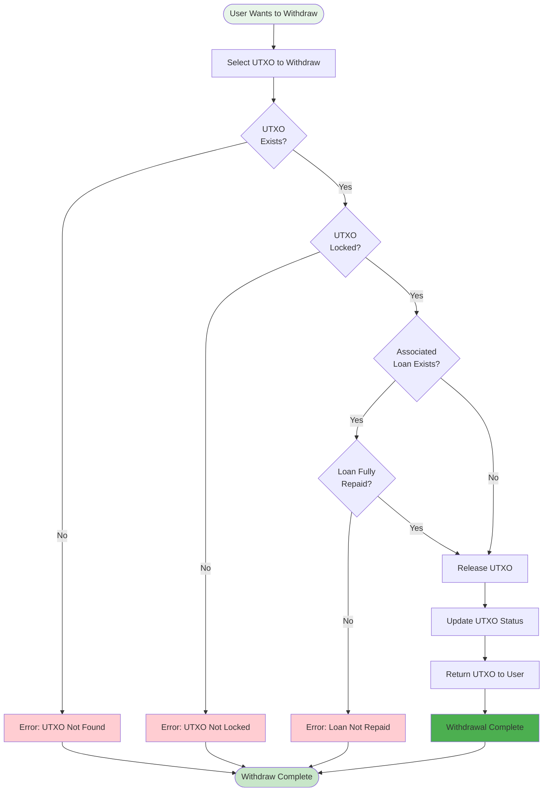
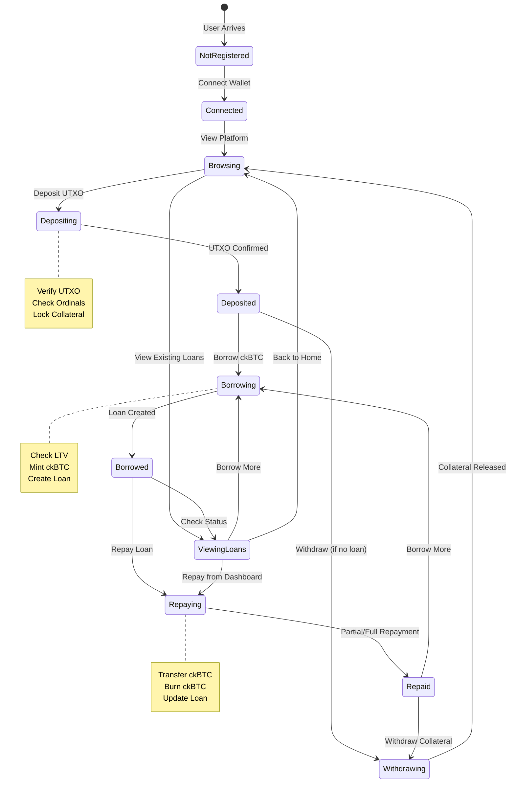
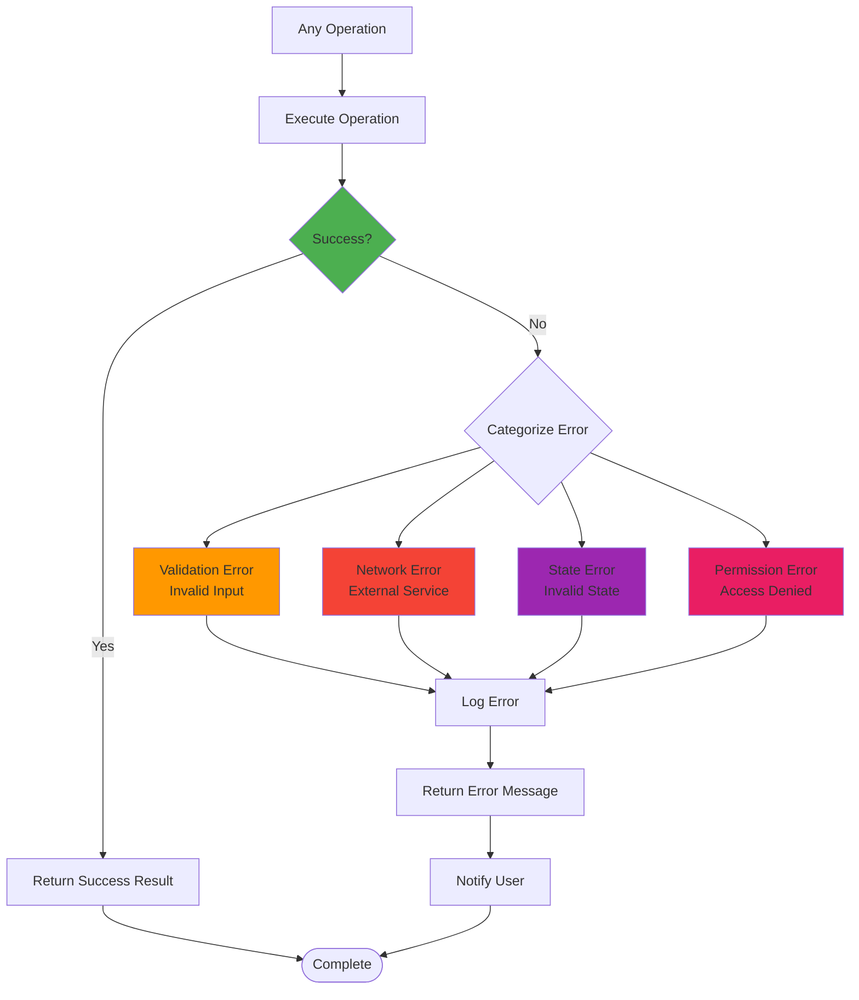
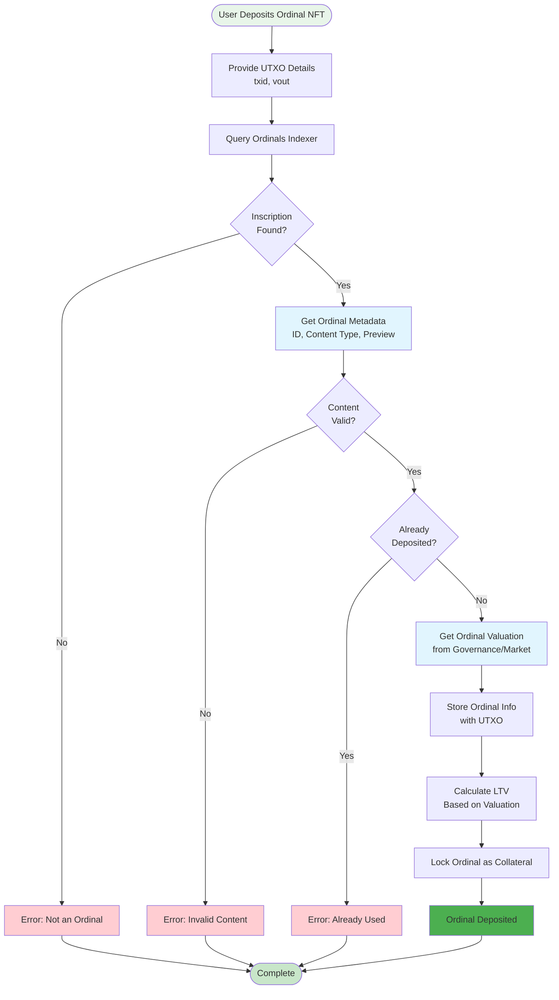

# BitFold Use Case Flowcharts

This document provides detailed flowcharts for all user interactions and use cases in the BitFold platform.

## Primary Use Cases

### 1. Deposit UTXO as Collateral

### 2. Borrow ckBTC Against Collateral

### 3. Repay Loan

### 4. Withdraw Collateral

## Complete User Journey

## Error Handling Flow

## Ordinals-Specific Use Case

